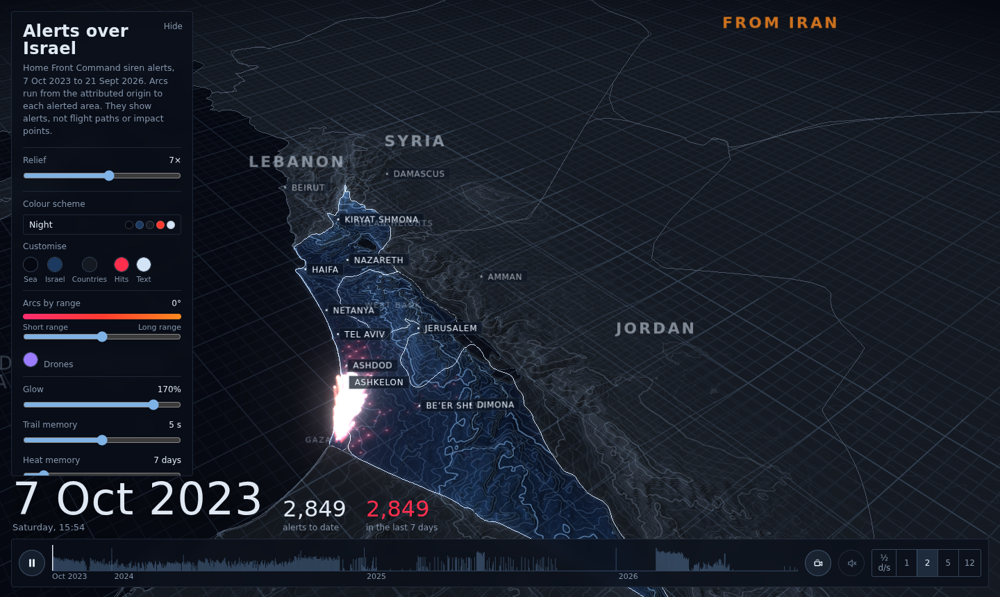

# Alerts over Israel, 2023–2026

An interactive 3D map of rocket, missile and drone siren alerts across Israel since 7 October 2023. Arcs run from the attributed origin to each alerted area, landing pulses and a fading heat layer mark alerted areas, and a timeline plays the whole period back.

**[Open the live map](https://0am1.github.io/israel-alerts/)**



> **What this shows, and what it does not.** Every arc is a siren alert recorded by Israel's Home Front Command, drawn from the origin attributed in the dataset to the alerted locality. Arcs are symbolic: they are not flight paths, and alerted areas are not impact points. Long-range arcs (Iran, Yemen) enter from the edge of the map in the direction of the origin.

## About this repository

The whole map is one self-contained file, `index.html` (about 1.7 MB), with all data embedded. There is no server, no build step and no tracking. The only network requests are for three.js (jsDelivr CDN) and the Barlow fonts (Google Fonts).

The data is a snapshot up to 21 September 2026.

## Run it locally

Download `index.html` and open it in a current Chrome, Edge, Firefox (113+) or Safari (16.4+). WebGL 2 is required. An internet connection is needed for three.js and the fonts.

If your browser blocks local files, serve the folder instead:

```sh
python3 -m http.server 8000
# then open http://localhost:8000
```

## Publish with GitHub Pages

In **Settings → Pages**, choose "Deploy from a branch", branch `main`, folder `/ (root)`. The map is then served at `https://USERNAME.github.io/REPOSITORY/`. Replace the placeholders in the link at the top of this file.

## Controls

| Action | How |
| --- | --- |
| Orbit, pan, zoom | Drag, right-drag (or two-finger drag), scroll or pinch |
| Play / pause | Space, or the play button |
| Step a day | Left and right arrow keys |
| Scrub | Click or drag the timeline |
| Auto camera | Camera button. Glides toward where alerts concentrate and pulls back when they spread nationwide. Any drag hands control back to you; it resumes after 5 seconds idle |
| Sound | Speaker button. A minimal tap per landing, panned by screen position |
| Colour scheme | Panel. Three dark and three light schemes; every colour circle can be changed, with a hue shift for arc range colours and a picker for drones |
| Place names | Panel, Layers. Town names fade in as you zoom in |

Other settings: relief exaggeration, glow, trail and heat duration, and filters by origin and threat type. "Other" (alerts with no attributed origin, drawn without an arc) starts switched off.

## Data sources and credits

| Data | Source | Terms |
| --- | --- | --- |
| Siren alerts, locality coordinates, English locality names | [yuval-harpaz/alarms](https://github.com/yuval-harpaz/alarms), compiled from Home Front Command (Pikud HaOref) alerts | No licence is declared in that repository. Please credit it, and check with its author before redistributing the raw data |
| Terrain | SRTM30+ (Becker et al., 2009, *Marine Geodesy* 32:4), via [jaanga/terrain-srtm30-plus](https://github.com/jaanga/terrain-srtm30-plus) | Freely available from Scripps Institution of Oceanography |
| Borders, lakes, populated places | [Natural Earth](https://www.naturalearthdata.com/) 1:10m | Public domain |
| 3D engine | [three.js](https://threejs.org/) 0.147.0, loaded from jsDelivr | MIT |
| Fonts | Barlow and Barlow Condensed, loaded from Google Fonts | SIL Open Font License |

Alerts are grouped into roughly 7 km areas in 10-minute windows; on the 58 heaviest days they are grouped more coarsely and drawn as fewer, thicker arcs. Terrain is about 1 km resolution. Boundaries are shown as they appear in Natural Earth, with the West Bank and Gaza outlined with dashed lines; their depiction is not an endorsement of any position.

## Licence

The application code in `index.html` is released under the [MIT Licence](LICENSE). The embedded data remains under the terms of its sources above.
